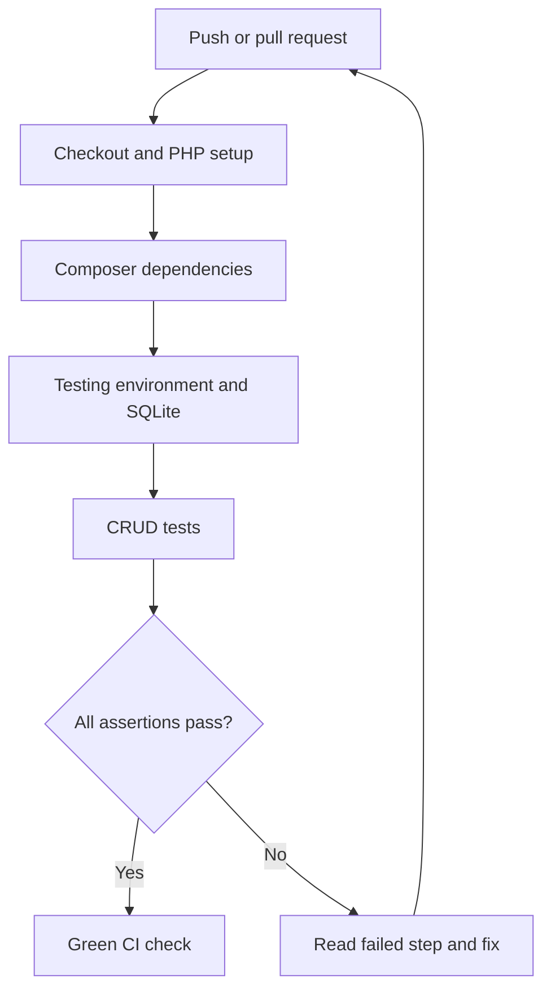

# Student Management API — Laravel CI practice starter


A small Laravel 13 API for **Lesson 5 — Continuous Integration for Laravel**. Students can create, list, view, update and delete student records, then configure GitHub Actions in their own forks to check the same behavior automatically.

**The starter intentionally contains no active CI workflow on `main`.** Follow the [Lesson 5 Practice Session](https://docs.google.com/presentation/d/1h1yP-l7Ai2SxtNX0Fq4tzq1g4h5qcoGm8vMUNMZhB6I/edit) to write your own workflow.

- [Individual student instructions](docs/LESSON5_PRACTICE.md)
- [Instructor: publish and restore a classroom regression](docs/INSTRUCTOR_GUIDE.md)

This is a local/classroom demo with synthetic data and **no authentication**. Do not expose it with real student information. A production system needs authentication, authorization and appropriate data protection.

## Requirements and quick start

PHP 8.3+, Composer 2, Git, and PHP's SQLite, PDO SQLite, mbstring, DOM/XML, fileinfo and curl extensions. No Node.js or MySQL is needed.

```bash
git clone https://github.com/maohieng/laravel-student-management-ci.git
cd laravel-student-management-ci
composer install
cp .env.example .env
php artisan key:generate
php -r "file_exists('database/database.sqlite') || touch('database/database.sqlite');"
php artisan migrate --seed
php artisan serve
```

Open <http://127.0.0.1:8000/api/students>. The seeder creates three fictional records and is safe to run again. On Windows use Git Bash for these shell examples, or copy the environment files using your file manager.

## API endpoints

Send `Accept: application/json`; send `Content-Type: application/json` when submitting JSON.

| Method | Endpoint | Purpose | Success |
|---|---|---|---|
| GET | `/api/students` | List, 10 per page (`?page=2`) | 200 |
| POST | `/api/students` | Create | 201 |
| GET | `/api/students/{id}` | View one | 200 |
| PUT | `/api/students/{id}` | Replace all editable fields | 200 |
| PATCH | `/api/students/{id}` | Update selected fields | 200 |
| DELETE | `/api/students/{id}` | Delete | 204 (empty body) |

Missing records return **404**. Invalid data returns **422** with an `errors` object. All four fields are required for POST/PUT. PATCH may omit unchanged fields, but supplied fields cannot be empty.

| Field | Validation |
|---|---|
| `student_number` | String, unique, maximum 30 characters |
| `name` | String, maximum 100 characters |
| `email` | Valid email, unique, maximum 255 characters |
| `course` | String, maximum 100 characters |

### Try the complete CRUD flow

```bash
# Create (use the returned data.id in subsequent requests)
curl -i http://127.0.0.1:8000/api/students \
  -H 'Accept: application/json' -H 'Content-Type: application/json' \
  -d '{"student_number":"STU-100","name":"Vanna Demo","email":"vanna@example.com","course":"DevOps"}'

# List
curl -H 'Accept: application/json' http://127.0.0.1:8000/api/students

# Replace 4 with the ID returned by POST
curl -H 'Accept: application/json' http://127.0.0.1:8000/api/students/4

# Partial update
curl -X PATCH http://127.0.0.1:8000/api/students/4 \
  -H 'Accept: application/json' -H 'Content-Type: application/json' \
  -d '{"course":"Laravel"}'

# Delete
curl -i -X DELETE -H 'Accept: application/json' http://127.0.0.1:8000/api/students/4
```

Single records are wrapped in `data`. Lists include `data`, `links` and `meta`. `requests.http` offers the same requests for an HTTP client/editor.

## Run tests locally

```bash
cp .env.testing.example .env.testing
php artisan key:generate --env=testing
composer test
```

The test suite covers CRUD, pagination, empty lists, required fields, invalid email, length limits, uniqueness, partial updates, full PUT validation, unknown input fields and missing records. `RefreshDatabase` prepares the schema and isolates each test.

Locally, PHPUnit defaults to an isolated in-memory SQLite database. In CI, the workflow sets an absolute file path in the process environment, which takes precedence over these defaults. CI explicitly migrates that disposable file before the tests. Never point test configuration at a real database.

## What CI does

After you create the workflow in your own fork, a push, pull request or manual **Actions → Laravel CI → Run workflow** starts a fresh Ubuntu runner:

1. Check out the code.
2. Install PHP 8.3 and Composer.
3. Install Composer dependencies (including test tools).
4. Copy environment templates, generate a testing application key and clear cached configuration.
5. Create an empty SQLite file and run migrations.
6. Run the API tests and read the result in the Actions log.



CI checks code; it does not deploy the application. A green check validates the tested scenarios, not every possible behavior. Requiring this check before merging is a separate repository branch-protection setting.

## Individual practice: green → sync → red → repair → green

1. Fork this starter into your personal account and enable Actions if prompted.
2. Use the practice slides to create `.github/workflows/laravel-ci.yml` yourself.
3. Push to your fork and review a successful baseline run.
4. Wait for the instructor to publish a deliberate response-status regression.
5. Fetch and merge `upstream/main`, then push to your fork to trigger your CI.
6. Read the failed test: expected 201, actual 200. Repair the controller, keep the test, and push again.
7. Show your initial green, failed, and repaired green run links. No long writing assignment is required.

Use a normal merge so your workflow remains in your fork. Do not hard-reset or force-sync to upstream. See the [student guide](docs/LESSON5_PRACTICE.md) for commands and existing-fork handling. The [instructor guide](docs/INSTRUCTOR_GUIDE.md) explains the exact change, when to publish it, and how to restore the starter. The intentional break has not been applied to the starter now.

## Where to look

- `routes/api.php`: API routes.
- `app/Http/Controllers/StudentController.php`: CRUD behavior.
- `app/Http/Requests/StudentRequest.php`: input validation.
- `app/Http/Resources/StudentResource.php`: response format.
- `app/Models/Student.php`: allowed database fields.
- `database/migrations/`: database schema.
- `tests/Feature/StudentApiTest.php`: executable examples.
- `.github/workflows/laravel-ci.yml`: the workflow you create in your own fork (intentionally absent upstream).
- `docs/LESSON5_PRACTICE.md`: individual fork, CI, sync, and repair instructions.
- `docs/INSTRUCTOR_GUIDE.md`: supervised regression and restoration guidance.

Laravel's application skeleton is adapted from [laravel/laravel](https://github.com/laravel/laravel). Framework documentation: [testing](https://laravel.com/docs/13.x/testing), [validation](https://laravel.com/docs/13.x/validation), [Eloquent resources](https://laravel.com/docs/13.x/eloquent-resources).
